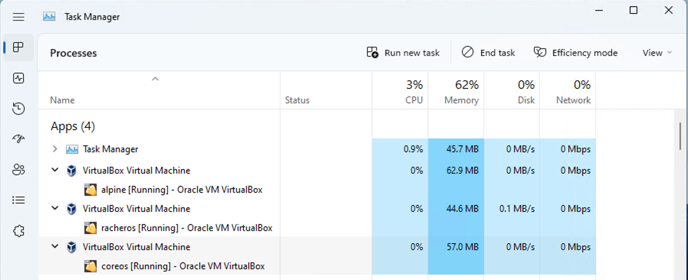

# Container Host OS

Evaluation 3 COntainer Host OS
- rancher os
- apline linux
- fedora coreos

# Comparison on VirtualBox

Each of the container OS is setup with 2 GB of RAM, 2 x vcpu and 20 GB of storage.
Below is the resource utilisation of the 3 OSes on the VM host.




racherOS has the smallest footprint of 44.6 MB
alpine linux has the largest footprint of 62.9 MB.
coreos takes up 57 MB of RAM.

# Comparison on Storage utilization

## rancher OS
```
Filesystem                Size      Used Available Use% Mounted on
overlay                  18.6G      2.9G     14.7G  17% /
tmpfs                   936.0M         0    936.0M   0% /dev
tmpfs                   998.0M         0    998.0M   0% /sys/fs/cgroup
none                    998.0M      1.5M    996.5M   0% /run
/dev/sda1                18.6G      2.9G     14.7G  17% /mnt
/dev/sda1                18.6G      2.9G     14.7G  17% /opt
/dev/sda1                18.6G      2.9G     14.7G  17% /media
/dev/sda1                18.6G      2.9G     14.7G  17% /home
devtmpfs                936.0M         0    936.0M   0% /host/dev
shm                      64.0M         0     64.0M   0% /host/dev/shm
/dev/sda1                18.6G      2.9G     14.7G  17% /usr/lib/firmware
/dev/sda1                18.6G      2.9G     14.7G  17% /etc/hosts
/dev/sda1                18.6G      2.9G     14.7G  17% /usr/sbin/iptables
/dev/sda1                18.6G      2.9G     14.7G  17% /etc/hostname
shm                      64.0M         0     64.0M   0% /dev/shm
```

## alpine linux
```
Filesystem                Size      Used Available Use% Mounted on
devtmpfs                 10.0M         0     10.0M   0% /dev
shm                     995.2M         0    995.2M   0% /dev/shm
/dev/vg0/lv_root         15.5G    409.7M     14.3G   3% /
tmpfs                   398.1M    184.0K    397.9M   0% /run
/dev/sda1               271.1M     19.2M    232.9M   8% /boot
tmpfs                   995.2M         0    995.2M   0% /tmp
cgroup_root              10.0M         0     10.0M   0% /sys/fs/cgroup
/dev/vg0/lv_root         15.5G    409.7M     14.3G   3% /var/lib/docker
```

## coreos
```
Filesystem      Size  Used Avail Use% Mounted on
devtmpfs        4.0M     0  4.0M   0% /dev
tmpfs           985M     0  985M   0% /dev/shm
tmpfs           394M  5.7M  389M   2% /run
/dev/sda4        20G  2.2G   18G  12% /sysroot
tmpfs           985M     0  985M   0% /tmp
/dev/sda3       350M  183M  145M  56% /boot
tmpfs           197M     0  197M   0% /run/user/1000
```

Note Alpine linux uses the least storage.


